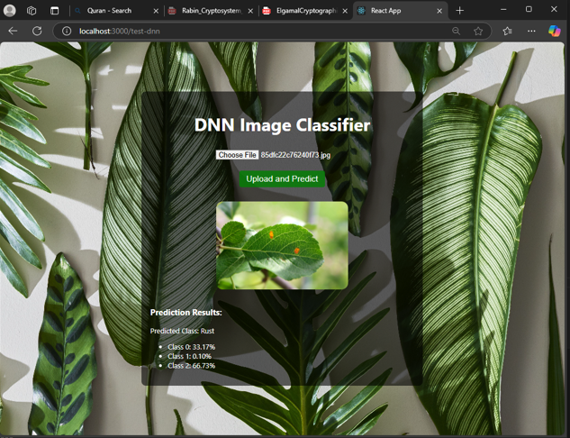

# **🌱 Plant Disease Detection Project**


## 📋 Project Overview

This project is an innovative approach to leveraging cutting-edge image processing, machine learning, and deep learning techniques for the detection of plant diseases from leaf images. By creating a comprehensive and efficient pipeline, we aim to revolutionize agricultural diagnostics.

### Key Features:
- **End-to-End Solution**: From preprocessing to deployment.
- **Accurate Predictions**: Achieving state-of-the-art results with machine learning and deep learning models.
- **User-Friendly Deployment**: A fully functional web application for real-time disease detection.

---

## 🛠️ Pipeline Breakdown

### Preprocessing
- **🖼️ Image Augmentation**: Enhances dataset diversity to improve model generalization.
- **❌ Noise Removal**: Filters out irrelevant artifacts for cleaner inputs.
- **🌟 Contrast Enhancement**: Boosts the visibility of critical features.

### Texture Analysis
Sophisticated feature extraction techniques:
- **📊 GLCM (Gray Level Co-occurrence Matrix)**: Captures textural patterns.
- **🖼️ LBP (Local Binary Patterns)**: Extracts local texture descriptors.
- **🌈 RGB Histogram**: Analyzes color distribution.
- **🎨 HSV Histogram**: Captures hue, saturation, and value properties.

### Machine Learning Models


Hyperparameter tuning conducted with **Optuna** on:
- 🌟 **XGBoost**: Delivered the best results.
- 🌳 **Random Forest**
- 📈 **KNN**
- 📉 **SVM**
- 🌲 **Decision Tree**

#### Best Results:
- **XGBoost with HSV features**:
  - ✅ Validation Accuracy: **96%**
  - ✅ Test Accuracy: **84%**

### Deep Learning with MobileNet
- Achieved exceptional results:
  - ✅ Test Accuracy: **95%**

---

## 🚀 Deployment Details



The project integrates a powerful backend and an intuitive frontend:
- **🔧 Backend**: Flask, providing a robust API for model inference.
- **🌐 Frontend**: React, ensuring a seamless user experience.

---

## 📂 Dataset

The dataset used for this project is publicly available and can be downloaded from:
[🔗 Plant Disease Dataset](https://www.kaggle.com/datasets/rashikrahmanpritom/plant-disease-recognition-dataset)

---

## 🚀 How to Operate the Project

### 🛠️ Step 1: Start the Backend (Flask)
1. Install the required libraries:
   ```bash
   pip install -r requirements.txt
   ```
2. Run the Flask app:
   ```bash
   python app.py
   ```

### 🌐 Step 2: Start the Frontend (React)
1. Navigate to the frontend directory:
   ```bash
   cd frontend
   ```
2. Install the required packages:
   ```bash
   npm install
   ```
3. Run the React app:
   ```bash
   npm start
   ```

### 🖼️ Step 3: Test with Images
1. Open your browser and navigate to [http://localhost:3000](http://localhost:3000).
2. Upload an image of a plant leaf.
3. View predictions and analysis in real-time with detailed results.

---

## 📊 Key Results

### Machine Learning (XGBoost + HSV Features)
- ✅ Validation Accuracy: **96%**
- ✅ Test Accuracy: **84%**

### MobileNet
- ✅ Test Accuracy: **95%**

### Deployment
- 🌟 Fully functional web application combining Flask backend and React frontend.
- 🌟 Real-time predictions with a user-friendly interface.

---

## 💡 Future Enhancements

- **🌍 Multi-Language Support**: Expand the application to support multiple languages for global accessibility.
- **📱 Mobile App**: Develop a mobile version for on-the-go disease detection.
- **📈 Continuous Learning**: Implement a feedback loop to improve model accuracy with user-uploaded images.
- **🌟 Cloud Integration**: Deploy on cloud platforms for scalable and fast inference.

---

## 🤝 Contributing

We welcome contributions to enhance the project. Please follow these steps:
1. Fork the repository.
2. Create a new branch for your feature.
3. Submit a pull request with detailed explanations.

---

## 👥 Contributors

<table>
  <tr>
    <td align="center">
      
      <br />
      <a href="https://github.com/salmamuhammede">Salma Muhammed</a>
    </td>
    <td align="center">
      
      <br />
      <a href="https://github.com/mostafarabie5">Mostafa Rabie</a>
    </td>
    <td align="center">
      
      <br />
      <a href="https://github.com/Abdulrahman-Mostafa10">Abdulrahman Mostafa</a>
    </td>
    <td align="center">
      
      <br />
      <a href="https://github.com/mukhaledd">Mukhaled</a>
    </td>
  </tr>
</table>

---

## 📝 License

This project is licensed under the MIT License. Feel free to use, modify, and distribute this project as per the license terms.

---

Thank you for exploring the Plant Disease Detection Project. Together, let's make agriculture smarter and more sustainable!

